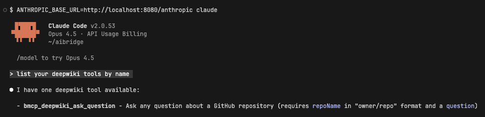

# aibridge

aibridge is an HTTP gateway that sits between AI clients and upstream AI providers (Anthropic, OpenAI). It intercepts requests to record token usage, prompts, and tool invocations per user. Optionally supports centralized [MCP](https://modelcontextprotocol.io/) tool injection with allowlist/denylist filtering.

## Architecture

```
┌─────────────────┐     ┌───────────────────────────────────────────┐
│    AI Client    │     │                    aibridge               │
│  (Claude Code,  │────▶│  ┌─────────────────┐    ┌─────────────┐   │
│   Cursor, etc.) │     │  │  RequestBridge  │───▶│  Providers  │   │
└─────────────────┘     │  │  (http.Handler) │    │  (Anthropic │   │
                        │  └─────────────────┘    │   OpenAI)   │   │
                        │                         └──────┬──────┘   │
                        │                                │          │
                        │                                ▼          │    ┌─────────────┐
                        │  ┌─────────────────┐    ┌─────────────┐   │    │  Upstream   │
                        │  │    Recorder     │◀───│ Interceptor │─── ───▶│    API      │
                        │  │ (tokens, tools, │    │ (streaming/ │   │    │ (Anthropic  │
                        │  │  prompts)       │    │  blocking)  │   │    │   OpenAI)   │
                        │  └────────┬────────┘    └──────┬──────┘   │    └─────────────┘
                        │           │                    │          │
                        │           ▼             ┌──────▼──────┐   │
                        │  ┌ ─ ─ ─ ─ ─ ─ ─ ┐      │  MCP Proxy  │   │
                        │  │    Database   │      │   (tools)   │   │
                        │  └ ─ ─ ─ ─ ─ ─ ─ ┘      └─────────────┘   │
                        └───────────────────────────────────────────┘
```

### Components

- **RequestBridge**: The main `http.Handler` that routes requests to providers
- **Provider**: Defines bridged routes (intercepted) and passthrough routes (proxied)
- **Interceptor**: Handles request/response processing and streaming
- **Recorder**: Interface for capturing usage data (tokens, prompts, tools)
- **MCP Proxy** (optional): Connects to MCP servers to list tool, inject them into requests, and invoke them in an inner agentic loop

## Request Flow

1. Client sends request to `/anthropic/v1/messages` or `/openai/v1/chat/completions`
2. **Actor extraction**: Request must have an actor in context (via `AsActor()`).
3. **Upstream call**: Request forwarded to the AI provider
4. **Response relay**: Response streamed/sent to client
5. **Recording**: Token usage, prompts, and tool invocations recorded

**With MCP enabled**: Tools from configured MCP servers are centrally defined and injected into requests (prefixed `bmcp_`). Allowlist/denylist regex patterns control which tools are available. When the model selects an injected tool, the gateway invokes it in an inner agentic loop, and continues the conversation loop until complete.

Passthrough routes (`/v1/models`, `/v1/messages/count_tokens`) are reverse-proxied directly.

## Observability

### Prometheus Metrics

Create metrics with `NewMetrics(prometheus.Registerer)`:

| Metric | Type | Description |
|--------|------|-------------|
| `interceptions_total` | Counter | Intercepted request count |
| `interceptions_inflight` | Gauge | Currently processing requests |
| `interceptions_duration_seconds` | Histogram | Request duration |
| `tokens_total` | Counter | Token usage (input/output) |
| `prompts_total` | Counter | User prompt count |
| `injected_tool_invocations_total` | Counter | MCP tool invocations |
| `passthrough_total` | Counter | Non-intercepted requests |

### Recorder Interface

Implement `Recorder` to persist usage data to your database. The example uses SQLite ([example/recorder.go](example/recorder.go)):

- `aibridge_interceptions` - request metadata (provider, model, initiator, timestamps)
- `aibridge_token_usages` - input/output token counts per response
- `aibridge_user_prompts` - user prompts
- `aibridge_tool_usages` - tool invocations (injected and client-defined)

```go
type Recorder interface {
    RecordInterception(ctx context.Context, req *InterceptionRecord) error
    RecordInterceptionEnded(ctx context.Context, req *InterceptionRecordEnded) error
    RecordTokenUsage(ctx context.Context, req *TokenUsageRecord) error
    RecordPromptUsage(ctx context.Context, req *PromptUsageRecord) error
    RecordToolUsage(ctx context.Context, req *ToolUsageRecord) error
}
```

## Example

See [example/](example/) for a complete runnable example with SQLite persistence and [DeepWiki](https://mcp.deepwiki.com) MCP integration.

### Setup

1. **Get API keys** from the provider consoles:
   - Anthropic: https://console.anthropic.com/settings/keys
   - OpenAI: https://platform.openai.com/api-keys

2. **Set environment variables**:
   ```bash
   export ANTHROPIC_API_KEY="sk-ant-..."
   export OPENAI_API_KEY="sk-..."
   ```

3. **Run the example**:
   ```bash
   cd example && go run .
   ```

4. **Test with curl**:
   ```bash
   curl -X POST http://localhost:8080/anthropic/v1/messages \
     -H "Content-Type: application/json" \
     -d '{
       "model": "claude-sonnet-4-20250514",
       "max_tokens": 1024,
       "messages": [{"role": "user", "content": "Hello!"}],
       "stream": true
     }'
   ```

5. **Test with Claude Code**:
   

## Supported Routes

| Provider | Route | Type |
|----------|-------|------|
| Anthropic | `/anthropic/v1/messages` | Bridged (intercepted) |
| Anthropic | `/anthropic/v1/models` | Passthrough |
| Anthropic | `/anthropic/v1/messages/count_tokens` | Passthrough |
| OpenAI | `/openai/v1/chat/completions` | Bridged (intercepted) |
| OpenAI | `/openai/v1/models` | Passthrough |
